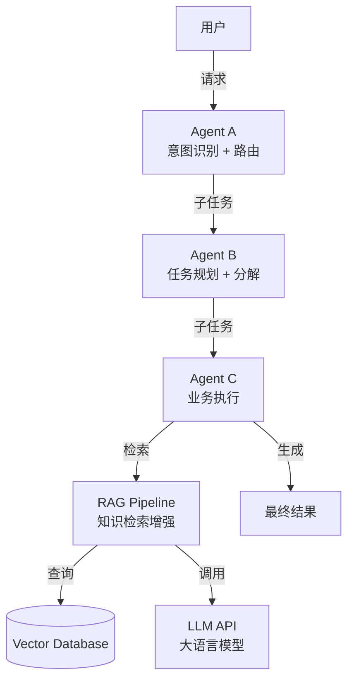
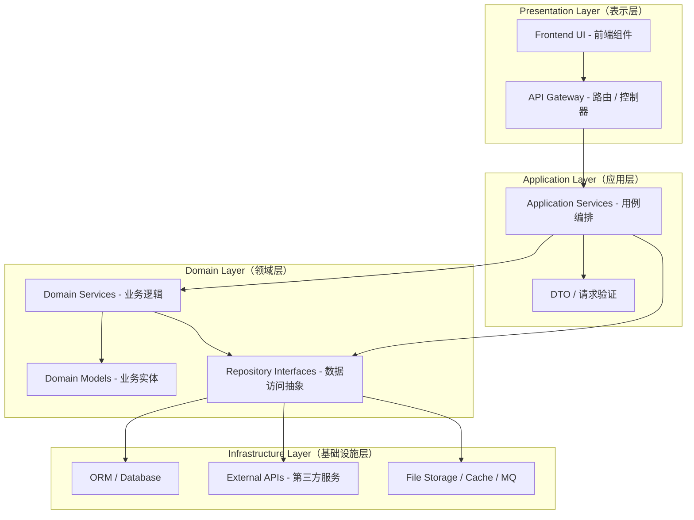
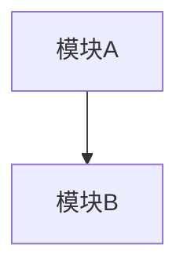
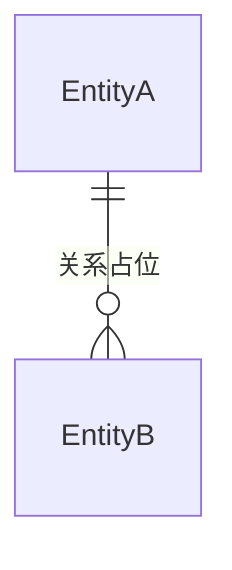

# 架构文档

> 由 R01-架构师 维护

---

## 0.1 技术可行性评估

> 由 R01-架构师在收到 PRD 后填写（阶段一），通过后方可进入架构设计（阶段二）。

| FR 编号 | 功能简述 | 可行性 | 风险等级 | 风险说明 |
|---------|---------|--------|---------|---------|
| — | — | — | — | — |

### 阻塞项

| 编号 | FR 编号 | 问题描述 | 建议处理 | 需反馈角色 |
|------|---------|---------|---------|-----------|
| — | — | — | — | — |

### 成本估算

| 成本项 | 月度估算 | 说明 |
|--------|---------|------|
| — | — | — |

### 评审结论

- [ ] 全部通过，可以进入架构设计（阶段二）
- [ ] 有风险但可接受
- [ ] 有阻塞项，需 PM 决策

---

## 0.2 技术选型与实现原则（全栈约束）

### 全栈成熟框架优先
- **前端**：必须使用成熟 UI 组件库（具体库由 R01 选型），禁止手写原生 UI 组件
- **后端**：必须使用成熟框架 + ORM 或查询构建器（具体框架由 R01 选型），禁止裸写 HTTP Server 或手写拼接 SQL
- **其他层次**：中间件、缓存、消息队列等优先选用成熟库，不自研

### 开源代码复用优先
- 实现具体功能前，先检索 GitHub 等平台是否存在经过验证的同类实现
- 评估维度：Star 数、维护活跃度、许可证、适配度
- 评估通过 → 优先复用；评估不通过 → 记录候选方案及不采纳理由

### 每项选型必须有具体理由
不可写"主流""大家都在用"。必须说明解决了什么问题、为什么优于替代方案。

---

## 1. 系统概述

### 1.1 代码目录约定（业务代码根目录）

> 全项目统一约定。所有任务卡「允许修改范围」、回报「文件清单」中的代码路径一律以本目录为根。

- **业务代码根目录**：仓库根下 `code/`。所有与业务相关的代码（前端、后端、测试、构建产物等开发过程中产生的代码）一律放在 `code/` 内。
- **禁止**：在仓库根目录或 `docs/`、`roles/`、`scripts/`、`task-cards/`、`reports/` 等框架/协作目录下并行创建业务代码文件。
- **内部结构**：按项目实际需要可在 `code/` 下分层（如 `code/backend/`、`code/frontend/`），由 R01 在架构设计中确定，本约定不强制。
- **物理位置**：代码类任务在独立 Worktree（`<仓库根>-TC{序号}`）中开发，其 `code/` 相对路径与主仓库一致，合并后汇总到 `develop` 的 `code/`。


## 2. AI 系统架构（Agent 运行时能力规范）

> **条件章节**：AI 项目必填，非 AI 项目省略本章。
> 定义 AI Agent 的拓扑、运行时能力、Prompt 策略、模型调用层、RAG 管道、上下文工程、可观测性、人机协同与成本控制。
> 本章由 R01（架构师）填写，是 AI 工程师（R09）的输入。

### 2.1 AI Agent 拓扑

> 示例拓扑：Agent 名称与职责为占位，R01 需按项目实际替换。



### 2.2 Agent 定义

| Agent | 职责 | 输入 | 输出 | 依赖 |
|-------|------|------|------|------|
| Agent A | [职责占位] | [输入占位] | [输出占位] | [依赖占位] |
| Agent B | [职责占位] | [输入占位] | [输出占位] | [依赖占位] |
| Agent C | [职责占位] | [输入占位] | [输出占位] | [依赖占位] |


> **硬约束（R01 必填）**：拓扑只定义"有哪些 Agent"，不构成 Agent 系统。每个 Agent 必须按下表补齐「运行时能力」；任一列缺失 = 架构设计不完整，R09 不得据此开工。

### 2.2.1 Agent 运行时能力清单（必填）

| Agent | 规划机制 | 工具注册表（工具名 + 入参/出参 schema） | 执行循环 | 失败恢复策略 | 结果验证方式 |
|-------|---------|--------------------------------------|---------|-------------|-------------|
| Agent A | [planner 拆解 / 单 Agent 循环] | [search_flights(query, date) → flight[]] | [plan→act→observe→verify，最大 N 轮] | [可重试：工具 5xx/超时退避 X 次；不可重试：转人工/终止] | [规则校验 / LLM 自校验 / 人工确认] |
| Agent B | [占位] | [占位] | [占位] | [占位] | [占位] |
| Agent C | [占位] | [占位] | [占位] | [占位] | [占位] |

**填写说明**：
- 规划机制：任务由谁拆解（独立 planner Agent 或主 Agent 循环），拆解结果写入哪个上下文通道（§2.9）
- 工具注册表：每个工具的名称、入参/出参 JSON Schema、幂等性、副作用标注（命中 §2.11 高风险清单 → 必须人工确认）
- 执行循环：轮次上限与终止条件（防死循环），observe 结果如何回填上下文
- 失败恢复：区分"可自动重试"（§2.8）与"必须人工介入"（§2.11）两类失败
- 结果验证：每步输出如何验证（规则 / LLM-as-judge / 人工），验证失败后的处理路径

### 2.3 Prompt 管理策略

| 维度 | 策略 | 说明 |
|------|------|------|
| Prompt 存储 | 独立文件（`prompts/{agent_name}.md`） | 每个 Agent 的 System Prompt 独立版本管理 |
| Prompt 版本化 | Git 管理 + 变更记录 | 每次 Prompt 修改记录到 `docs/decisions.md` |
| 变量注入 | `{variable_name}` 占位符 | 运行时由 Application Layer 填充用户上下文 |
| 安全边界 | Prompt 中不嵌入 secrets / API keys | 敏感信息通过环境变量注入 |
| Token 预算 | 每个 Prompt 标注预估 token 数 | System Prompt < 2000 tokens，User Prompt < 3000 tokens |

### 2.4 模型调用层

| 维度 | 策略 | 说明 |
|------|------|------|
| 模型选型 | [待定：主模型 / 备选模型] | 主模型 + 备选模型（故障切换） |
| 调用方式 | Infrastructure Layer 统一封装 | `class LLMClient` 不散落在业务代码中 |
| 超时控制 | 单次调用 ≤ 30s，总超时 ≤ 120s | 超时后走降级策略 |
| 重试策略 | 指数退避，最多 3 次 | 429 限流 / 5xx 服务端错误重试 |
| 降级策略 | 返回缓存结果 / 默认建议 / 提示用户稍后重试 | 不可让用户看到原始错误 |

### 2.5 RAG Pipeline


| 阶段 | 技术方案 | 说明 |
|------|---------|------|
| Embedding | [待定：Embedding 模型] | 维度按模型定义 |
| 向量数据库 | [待定：向量数据库] | Top-K / 相似度阈值 [待定] |
| Reranker | [待定：Reranker 模型] | 精排 Top-K [待定] |
| 分块策略 | 每块 {X} tokens，重叠 {Y} tokens | 按文档结构分块（段落/章节） |

### 2.6 知识库更新机制

| 维度 | 策略 |
|------|------|
| 更新触发 | 定时（每周）+ 事件驱动（新增领域知识时） |
| 增量更新 | 仅更新变更的文档块，不全量重建 |
| 版本管理 | 每次更新生成新版本号，旧版本保留 3 个 |
| 质量审核 | 新增知识需人工审核后入库（MVP 阶段可简化） |
| 过期处理 | 超过 1 年未更新的领域数据标记为过期，降低检索权重 |

### 2.7 Token 成本控制

| 维度 | 目标 | 措施 |
|------|------|------|
| 单次调用成本 | < ¥{X} | 限制 Prompt 长度 + 缓存常见查询 |
| 日成本上限 | < ¥{X}（MVP 阶段） | 每日调用次数限制（如 {X} 次/天） |
| 缓存策略 | 相同查询 1 小时内复用 | [待定缓存方案] 缓存 LLM 响应 |
| 模型降级 | 主模型不可用时降级到轻量模型 | 降级后功能减少但可用 |

### 2.8 AI 错误处理

| 错误类型 | 处理策略 | 用户看到 |
|---------|---------|---------|
| LLM 超时 | 重试 1 次 → 降级模型 | "分析耗时较长，请稍后查看结果" |
| LLM 限流（429） | 指数退避 → 队列化 | 无感知（后台重试） |
| RAG 无结果 | 仅用 LLM 自身知识 + 标注 | "以下建议基于通用知识，仅供参考" |
| 输出格式异常 | 正则校验 + 重试 | "分析结果格式异常，正在重新生成" |
| Token 超预算 | 截断上下文 + 简化输出 | 结果可能较简略 |

### 2.9 上下文工程（Context Engineering）

> 上下文工程 ≠ 保存聊天记录。核心是让模型在**正确时机获取正确的信息**，并排除无关信息干扰。由 R01 设计（本章），R09 实现。

**上下文要素（每个 Agent 必填设计）**

| 信息类型 | 来源 | 注入时机 | 裁剪策略 |
|---------|------|---------|---------|
| 当前任务状态 | 任务拆解结果 / 执行中间产物 | 执行循环每轮开始前 | 只注入当前子任务相关状态，过期步骤摘要化 |
| 对话上下文 | 多轮对话记录 | 每轮请求 | 短期窗口（最近 N 轮全文）+ 更早轮次摘要 |
| 用户历史记忆 | 用户画像 / 长期偏好存储 | 涉及个性化决策时 | 按相关性检索，不全文注入 |
| 企业知识库 | RAG 检索结果（§2.5） | 查询/决策前 | Top-K + Rerank 后注入，标注引用来源 |
| 工具调用结果 | 工具返回（§2.2.1） | 工具返回后、下一步决策前 | 截断超长结果，保留结构化摘要与错误信息 |

**记忆方案（必选其一，写明理由）**：
- 短期记忆：对话窗口 + 滚动摘要（适用单轮/短会话场景）
- 长期记忆：向量库存储用户偏好与历史，按需检索（适用个性化/跨会话场景）
- Token 预算：所有注入计入 §2.3 / §2.7 预算，超限按「任务状态 > 知识库 > 对话历史 > 用户记忆」优先级裁剪

**抗干扰规则（必填）**：
- 明确声明哪些信息**禁止**进入上下文（无关工具结果、历史失败详情、未授权数据）
- 每条注入信息标注来源与时效；允许模型对无依据信息声明"无依据"，不强行补全

### 2.10 可观测性与链路追踪（Observability & Tracing）

> 目的：任何一次请求都能回答"调用了哪个 Agent、用了什么模型、调了哪些工具、工具是否成功、失败在哪一步、耗时与成本"。由 R01 设计（本章），R09 实现埋点，R06 负责部署监控（责任矩阵见 `docs/质量验收标准.md` §1.2）。

**trace_id 规范**
- 入口生成 UUID，贯穿整条请求链；每次子调用携带父 span 引用（trace_id + parent_span_id）
- 采样策略：开发/评估环境全量采样；生产按比例采样（默认 10%，可配置）

**span 类型与必埋点**

| Span 类型 | 覆盖动作 | 必埋字段 | 对应追问 |
|----------|---------|---------|---------|
| agent | Agent 执行整体 | agent 名、输入摘要、任务完成状态 | 调用了哪个 Agent |
| tool | 工具调用 | 工具名、入参/出参摘要、成功/失败、错误码 | 调了哪些工具/是否成功 |
| llm | 模型调用 | model、prompt/completion tokens、latency、success | 成本/速度 |
| rag | 检索 | Top-K、命中数、rerank 后结果数、耗时 | 检索效果 |

**任务级指标（R09 回报必填）**

| 指标 | 定义 | 目标 |
|------|------|------|
| 任务完成率 | 多步任务端到端成功比例 | ≥ X%（PM 确认） |
| 工具调用成功率 | 成功工具调用 / 总调用 | ≥ X% |
| 人工接管率 | 需人工介入的任务比例 | ≤ X% |
| 端到端延迟 P95 | 任务完成耗时分位 | ≤ Xs |

**告警项**：工具失败率突增、单任务 token 超预算、人工接管率异常升高、端到端延迟 P95 超限。

### 2.11 人机协同（Human-in-the-Loop）

> 最好的 Agent 不一定是全自动。高风险操作必须保留人工确认节点。由 R01 设计、R09 实现。

**高风险操作清单（R01 逐项确认，命中即必须人工确认）**

| 操作类型 | 判定标准 | 确认方式 | 超时降级 |
|---------|---------|---------|---------|
| 发送邮件 | 对站外真实收件人发送 | 确认卡片（收件人 + 内容预览） | 超时取消发送 |
| 提交审批 | 创建审批流 / 变更审批状态 | 跳转审批页 | 超时挂起，不自动通过 |
| 资金操作 | 支付 / 转账 / 退款 | 二次确认 + 金额展示 | 超时取消 |
| 隐私数据处理 | 读取 / 导出 / 共享个人敏感信息 | 展示数据范围 + 用途说明 | 超时拒绝执行 |

**设计约束**：
- 人工确认节点必须有状态机：pending → approved / rejected / timeout，全程入审计日志
- Agent 不得绕过确认节点（代码层强制，非 Prompt 约束）
- 确认节点接口契约写入 `docs/contracts/`（如 POST /api/v1/approvals）
- 用户可见"哪些操作在等待人工确认、当前卡在哪一步"

### 2.12 R01 → R09 交接清单

> 本章是 AI 工程师（R09）的输入。R09 负责 Prompt 实现、模型 API 集成、向量数据库搭建、知识库实现、上下文装配、链路埋点与人机协同实现。

| R01 负责（What） | R09 负责（How） |
|-----------------|----------------|
| Agent 拓扑和职责 | Agent 框架选型（LangChain / AutoGen / 自研） |
| Agent 运行时能力（§2.2.1：规划/工具/循环/恢复/验证） | 规划器、工具注册表、执行循环、验证器实现 |
| Prompt 策略和边界 | Prompt 具体编写和调优 |
| 模型选型建议 | 模型 API 集成和切换逻辑 |
| RAG 管道设计 | 向量数据库部署和索引配置 |
| 知识库更新策略 | 知识入库脚本和定时任务 |
| 上下文工程策略（§2.9） | 上下文装配、记忆、裁剪实现 |
| 可观测性设计（§2.10） | trace 埋点、任务级指标上报 |
| 人机协同节点（§2.11） | 确认流程 / 审批流实现 |
| Token 成本目标 | 成本监控和限流实现 |

## 3. 系统分层

> 定义代码的垂直切分边界。每一层有明确的职责和依赖方向。
> **依赖规则**：上层可以依赖下层，下层不可依赖上层。所有层不可反向依赖。



### 3.1 各层职责与约束

| 层 | 职责 | 可以做什么 | 禁止做什么 |
|----|------|-----------|-----------|
| **Presentation** | 接收用户输入、展示数据 | 路由定义、请求参数解析、响应格式化、UI 组件渲染 | ❌ 写业务逻辑 ❌ 直接操作数据库 ❌ 调用外部 API |
| **Application** | 用例编排、事务边界 | 调用 Domain Service 组合业务流程、DTO 转换、权限校验入口 | ❌ 包含业务规则 ❌ 直接写 SQL |
| **Domain** | 核心业务逻辑 | 定义实体和值对象、实现业务规则、定义 Repository 接口 | ❌ 依赖框架细节 ❌ 直接操作数据库 ❌ 调用外部 API |
| **Infrastructure** | 技术实现细节 | ORM 实现、外部 API 调用、文件存储、缓存、消息队列 | ❌ 包含业务规则（只提供技术能力） |

### 3.2 分层落地规则（所有开发者必读）

1. **Controller（Presentation）只做参数校验和路由，不写任何 if-else 业务判断**
2. **Service（Application）编排 Domain，不直接操作 ORM**
3. **Domain 层不依赖任何 Web 框架**
4. **所有外部 API 调用（第三方服务）必须封装在 Infrastructure 层**

### 3.3 分层与技术栈的对应

| 分层 | 本项目技术选型 | 备注 |
|------|-------------|------|
| Presentation（前端） | [待定] | UI 组件库 + 状态管理 |
| Presentation（后端） | [待定] | Routes + Middleware |
| Application | [同上后端框架] | Service 层 + DTO |
| Domain | 领域层代码 | 不依赖 Web 框架 |
| Infrastructure | [待定] | ORM + 外部 API Client |


## 4. 模块拓扑



## 5. 技术栈

| 层次 | 技术选型 | 版本 | 理由（必须具体） |
|------|---------|------|-----------------|
| 前端框架 | — | — | — |
| UI 组件库 | — | — | — |
| 后端框架 | — | — | — |
| ORM | — | — | — |
| 数据库 | — | — | — |
| 缓存 | — | — | — |
| 部署 | — | — | — |

## 6. 开源方案评估记录

| 功能模块 | 候选方案 | 来源 | 评估结果 | 理由 |
|---------|---------|------|---------|------|
| — | — | — | 复用 / 未采用 | — |

## 7. 逻辑数据模型

> **边界定义**：R01（架构师）定义逻辑数据模型（What）——实体、属性、关系、业务约束。
> R05（数据工程师）负责物理实现（How）——表结构、字段类型、索引、迁移脚本、ORM Model。
> 本节由 R01 填写，是 R05 的输入。

### 7.1 实体清单

| 实体 | 描述 | 关键属性（逻辑层面） | 预估数据量级 |
|------|------|-------------------|------------|
| — | — | — | — |

### 7.2 实体关系



### 7.3 实体关系说明

| 关系 | 类型 | 说明 |
|------|------|------|
| — | — | — |

### 7.4 业务约束（逻辑层面）

| 编号 | 约束 | 说明 |
|------|------|------|
| — | — | — |

### 7.5 R01 → R05 交接清单

> 以下内容由 R05（数据工程师）基于本章的逻辑模型进行物理实现。
> R05 的输出写入 `docs/data-model.md`（物理数据模型独立文件，由 R05 维护——避免与 R01 双写 architecture.md）。

R05 需要基于本章产出：
- 数据库表结构（字段名、字段类型、约束、默认值）
- 索引设计及理由
- 迁移脚本（版本化管理）
- ORM Model 定义
- 敏感字段加密方案

R05 的设计自由度：
- ✅ 字段命名可以调整（遵循项目命名规范，如 snake_case）
- ✅ 字段类型可以调整为最适合的数据库类型
- ✅ 可以增加技术字段（如 id、created_at、updated_at、deleted_at）
- ✅ 索引设计自主决定
- ❌ 不可增删实体
- ❌ 不可改变实体间的关系类型（1:N / N:M / 1:1）
- ❌ 不可违反业务约束（C-001 ~ C-XXX）

### 7.6 物理数据模型

> 物理数据模型独立维护于 `docs/data-model.md`，由 R05（数据工程师）全权负责，完成后通知 R01 确认。
> 本文档（architecture.md）由 R01 维护——R01 与 R05 不直接编辑对方文件，避免双写冲突（文件权限见 `roles/R05-数据工程师.md`）。

## 8. 接口契约

> 每个 API 端点必须包含以下三项，缺一不可：
> 1. 请求 JSON 示例（完整可复制的 JSON）
> 2. 成功响应 JSON 示例
> 3. 该端点可能返回的业务错误码清单

### 8.1 契约格式规范

> **契约格式唯一权威：`docs/contracts/README.md`**（含单端点标准模板：请求 JSON 示例 / 成功响应 JSON 示例 / 错误码清单 / 约束）。每个契约一个独立文件，写入 `docs/contracts/{模块名}-contract.md`，按该模板编写。本节不复制模板——避免双份漂移（R01 修改格式时只改 `contracts/README.md`）。

### 8.2 契约检查清单（R01 产出时自检）

每个契约产出前，逐条确认：

- [ ] 请求有完整的 JSON 示例（可直接复制粘贴测试）
- [ ] 成功响应有完整的 JSON 示例
- [ ] 所有字段的类型和必填性已标注
- [ ] 错误响应有 JSON 示例
- [ ] 列出了该端点所有可能的业务错误码（含错误码编号 + 名称 + 说明 + HTTP 状态码）
- [ ] 业务约束已在「约束」区域写清楚

### 8.3 响应信封规范

所有 API 响应使用统一信封：

```json
{
  "code": 0,
  "message": "ok",
  "data": { }
}
```

| 字段 | 类型 | 说明 |
|------|------|------|
| code | int | 0 = 成功，非 0 = 错误（见 §10 错误码规范） |
| message | string | 人类可读的描述 |
| data | object / null | 成功时返回业务数据，错误时为 null |

## 9. 数据流

### 9.1 请求主链路（后端 API）
用户请求 → Controller（路由/参数校验）→ Service（编排/事务/权限）→ Domain（业务规则）→ Infrastructure（Repository / 外部调用封装）→ 数据源；响应按 §8.3 信封（code / message / data）返回。异常经全局异常处理器按 §10 错误码映射，不向用户暴露内部细节。

### 9.2 AI 调用链路（AI 项目）
前端 → Service → LLMClient（统一封装：单次 ≤30s、指数退避重试 ≤3 次仅 429/5xx、降级与主备切换）→ LLM API；检索类任务经 RAG Pipeline（§2.5）补充上下文；调用与降级事件写入日志和可观测性链路（§2.10）。

### 9.3 数据写链路
写入一律经 Repository 与迁移脚本（§3），禁止绕过分层直连数据库；创建类操作须支持幂等（Idempotency-Key 或状态检查）。

## 10. 错误码规范

> 所有后端 API 必须使用统一的错误码体系。前端不可自行解释 HTTP 状态码——必须以响应体中的 `code` 字段为准。

### 10.1 错误码编码规则

| 范围 | 分类 | 说明 |
|------|------|------|
| 0 | 成功 | 请求正常处理 |
| 1001-1999 | 认证/授权错误 | 未登录、token 过期、权限不足 |
| 2001-2999 | 参数校验错误 | 缺少必填字段、格式错误、值不合法 |
| 3001-3999 | 业务规则错误 | 状态不允许、配额用完、数据冲突 |
| 4001-4999 | 资源错误 | 资源不存在、资源已删除 |
| 5001-5999 | 外部依赖错误 | 外部依赖超时、失败、异常 |
| 6001-6999 | 系统内部错误 | 数据库错误、未知异常（用户不应看到详情） |

### 10.2 全局错误码（所有端点通用）

| 错误码 | 名称 | 说明 | HTTP 状态码 |
|--------|------|------|------------|
| 0 | SUCCESS | 成功 | 200 |
| 1001 | UNAUTHORIZED | 未登录或 token 无效 | 401 |
| 1002 | FORBIDDEN | 权限不足 | 403 |
| 1003 | TOKEN_EXPIRED | token 已过期 | 401 |
| 2001 | INVALID_PARAM | 请求参数不合法 | 400 |
| 2002 | MISSING_REQUIRED | 缺少必填字段 | 400 |
| 6001 | INTERNAL_ERROR | 服务器内部错误 | 500 |

### 10.3 业务错误码（按模块定义，见各契约文件）

每个端点在自己的契约文件中定义专有的业务错误码。编号使用所属范围的子区间，不得与全局错误码冲突。

## 11. 风险与权衡

## 12. 技术债务登记册

> 由 R01（架构师）维护。记录架构层面已知的技术债务——这些是「知道不够好、但现在不修」的权衡。
> PM 定期审阅本表，将高优先级债务转化为清理任务卡。
>
> **与 reports/ 的区别**：reports/ 中的技术债务是单次任务级别的（如「xxx 函数性能可优化」）。
> 本表记录的是架构级别的债务（如「整个模块使用了临时方案」），跨任务卡累积。

### 12.1 债务清单

| 编号 | 问题 | 原因 | 影响 | 偿还计划 | 优先级 | 状态 |
|------|------|------|------|---------|--------|------|
| — | — | — | — | — | — | — |

**示例**：

| 编号 | 问题 | 原因 | 影响 | 偿还计划 | 优先级 | 状态 |
|------|------|------|------|---------|--------|------|
| TD-001 | {问题描述} | {原因} | {影响} | {偿还计划} | P1/P2/P3 | open |
| TD-002 | {问题描述} | {原因} | {影响} | {偿还计划} | P1/P2/P3 | open |
| TD-003 | {问题描述} | {原因} | {影响} | {偿还计划} | P1/P2/P3 | open |

### 12.2 债务生命周期

```
R01/R02/R04 在回报中标注技术债务
        ↓
R01 审阅 → 判断是否属于架构级债务
        ↓
   ┌── 是 → 登记到本表（分配 TD-XXX 编号）
   │
   └── 否 → 保留在回报文件中（任务级债务）
        ↓
PM 定期审阅本表 → 评估优先级和时机
        ↓
   ┌── 时机成熟 → PM 创建「技术债务清理」任务卡 → 派发 → 完成 → 标记 resolved
   │
   └── 时机未到 → 保持 open，下次再审
```

### 12.3 各角色技术债务上报规范

| 角色 | 上报位置 | 上报格式 |
|------|---------|---------|
| R02 / R04 / R05 | `reports/TC-XXX-回报.md` §7 | 自由文本或结构化（建议参考本表格式） |
| R01 | 直接登记到本表 | 必须用本表的 TD-XXX 格式 |
| R03 | `reports/TC-XXX-回报.md` §7 | 测试覆盖缺口、自动化不足等 |
| PM | 审阅后认为应升级的 | 通知 R01 登记到本表 |

---

## 13. 变更记录

| 日期 | 变更内容 | 变更人 |
|------|---------|--------|
| — | — | — |


---

## 14. ADR 索引

> 架构冻结点之后，对本文档和 `contracts/` 的任何修改必须先通过 ADR。
> ADR 文档存储在 `docs/adr/`（规则/编号/状态见 `docs/adr/README.md`），编号全局递增。ADR 由 R01 起草，**PM 验收通过后 accepted 并登记本索引**；重大技术选型类 ADR 经用户确认（见 `docs/adr/README.md`「生命周期与批准流程」）。

| ADR 编号 | 标题 | 状态 | 提出时间 | 影响章节 |
|---------|------|------|---------|---------|
| — | — | — | — | — |
