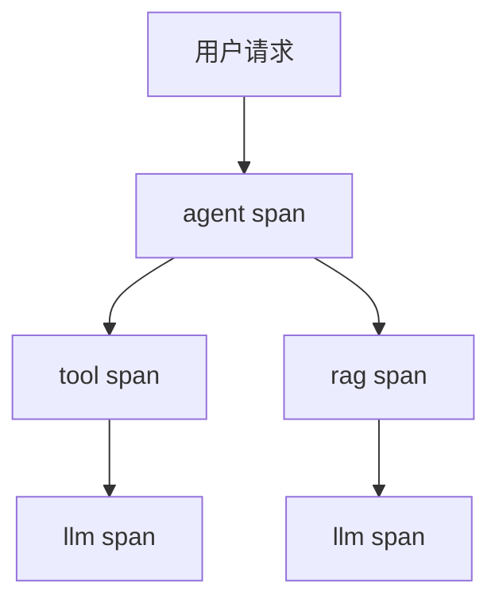

# Agent 链路可观测性设计/实现说明

> **版本**：v0.1
> **维护人**：R09-AI 工程师
> **最后更新**：YYYY-MM-DD
> **关联**：`docs/architecture.md` §2.10（可观测性与链路追踪）、`docs/质量验收标准.md` §1.2（责任矩阵）
> **依据模板**：`docs/templates/agent-observability-template.md`
> **落盘位置**：项目内 `docs/ai-observability.md`

---

## 1. 追踪拓扑（span 类型与父子关系）

| Span 类型 | 覆盖动作 | 父级 | 说明 |
|----------|---------|------|------|
| agent | Agent 执行整体 | 请求根（trace 入口） | 每个被调用的 Agent 各一个 |
| tool | 工具调用 | 所属 agent span | 工具名 + 入参/出参摘要 |
| llm | 模型调用 | 所属 agent / tool span | model + token + latency |
| rag | 检索 | 所属 agent span | Top-K / 命中 / 耗时 |

<!-- 使用 Mermaid 画出实际调用链（必填） -->



## 2. trace_id 规范

| 项 | 规范 |
|----|------|
| 生成 | 入口（HTTP 请求 / 队列消息）生成 UUID，贯穿整条请求链 |
| 透传 | 每次子调用携带 trace_id + parent_span_id；跨服务经 HTTP 头（如 `x-trace-id`）透传 |
| 采样 | 开发/评估环境全量；生产默认 10%（可配置），失败请求强制保留 |

## 3. 必埋点清单

| 事件 | 必埋字段 | 触发时机 |
|------|---------|---------|
| agent 开始/结束 | agent 名、输入摘要、完成状态（success/failed/timeout） | 执行循环进入/退出 |
| 工具调用 | 工具名、入参摘要、出参摘要、成功/失败、错误码、耗时 | 工具返回后 |
| LLM 调用 | model、prompt_tokens、completion_tokens、latency、success | 每次模型调用 |
| RAG 检索 | Top-K、命中数、rerank 后结果数、耗时 | 检索完成 |
| 人工确认节点 | 操作类型、确认状态（pending/approved/rejected/timeout）、耗时 | 状态机流转 |
| 成本 | 单次任务累计 token / 估算成本 | 任务结束 |

## 4. 任务级指标定义

| 指标 | 定义 | 计算方式 | 目标 |
|------|------|---------|------|
| 任务完成率 | 多步任务端到端成功比例 | 成功任务数 / 总任务数 | ≥ X% |
| 工具调用成功率 | 工具调用成功比例 | 成功调用次数 / 总调用次数 | ≥ X% |
| 人工接管率 | 需人工介入的任务比例 | 人工介入任务数 / 总任务数 | ≤ X% |
| 端到端延迟 P95 | 任务完成耗时分位 | 分位数统计 | ≤ Xs |

## 5. 告警规则

| 告警 | 触发条件 | 通知对象 |
|------|---------|---------|
| 工具失败率突增 | 工具失败率 > X%（对比前 1 小时基线） | R09 / R06 |
| 单任务超预算 | 单任务 token > X | R09 |
| 人工接管率异常 | 人工接管率 > X% | PM / R09 |
| 延迟超限 | 端到端延迟 P95 > Xs 持续 X 分钟 | R06 |

## 6. 看板 / 查询样例

<!-- 填项目实际监控平台（CLS / 云监控 / Grafana 等）的查询示例，至少覆盖一次失败请求的完整调用链定位 -->

```
查询样例：{平台} 按 trace_id 检索 span，定位失败步骤与耗时分布
```

## 7. 责任边界

| 域 | 责任主体 | 说明 |
|----|---------|------|
| 可观测性设计（span/埋点/指标） | R01 | `architecture.md` §2.10 |
| 埋点实现与指标上报 | R09 | 本文档 + 代码实现 |
| 部署监控 / 告警接入 | R06 | 生产环境日志/指标平台 |
| 外部证据验收 | R03 / PM | `docs/质量验收标准.md` §1.2 责任矩阵 |

## 8. 变更记录

| 日期 | 变更内容 | 变更人 |
|------|---------|--------|
| YYYY-MM-DD | 初版 | R09 |