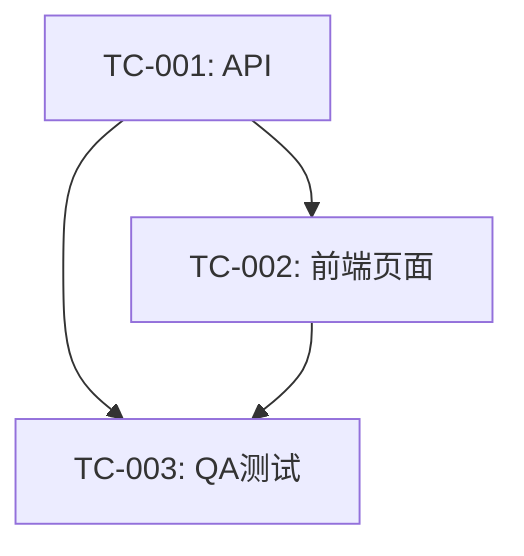

# TC-{序号}：{一行简述任务内容}

> **元数据说明**：状态、角色、依赖、工作目录、分支、基线、验收标准评审记录（acceptance_reviewed_by）等结构化字段以文件头 YAML front-matter 为**唯一权威**（机器可读）。`scripts/validate-task-card.ps1`、`patrol.ps1`、`generate-status.ps1`、`merge-card.ps1` 均读取 front-matter，勿在正文中另写一份状态表。下方「基本信息（可选）」仅记录人类决策提示，脚本不校验。

## 基本信息（可选，仅决策提示）

| 字段 | 值 |
|------|-----|
| **建议模型** | 默认继承父代理（PM）模型（无需填写）；仅特殊需求时 PM 显式指定模型或等级 |
| **默认 skill** | 按角色定义文件 `roles/R0X-*.md`「Skill 绑定」小节角色级默认；可指定（如 `design-taste-frontend`）或写「无」取消 |
| **建议推理强度** | 默认继承父代理推理强度（无需填写）；仅特殊需求时可选覆盖：[low / medium / high / xhigh] |
| **预计复杂度** | [低 / 中 / 高]（**=高**的卡属大卡，派发前必须经 R03 评审验收标准，评审记录写入 front-matter `acceptance_reviewed_by`，见 `PM-操作指南.md` §3.0） |
| **预计工期** | X 轮对话（DSH 下 1 轮 ≈ 1 次 subagent run；Codex 下为对话轮次） |
| **检查点** | 无 或 中间里程碑（预计复杂度=高或工期长者必填：第 X 轮向 PM 回报中间进度，PM 据此采样，见 `docs/自动化协作协议.md` §四） |
| **测试要求** | 无 或 自动化测试范围（框架 / 文件 / 最低门槛；不适用时写明理由，如纯文档任务） |

## 任务目标

<!-- 1-3 句话说清楚要交付什么，AI 读完这段就知道"我要干嘛" -->

## 背景信息

<!-- AI 需要了解的上下文、为什么需要做这个、和哪个模块有关 -->

## 允许修改范围

<!-- 精确到文件路径，越具体越好 -->

- `code/module/file1.py`：添加 xxx 功能
- `code/module/file2.py`：修改 yyy 方法
- `code/tests/test_module.py`：添加对应单元/组件测试（任务卡「测试要求」为自动化测试时必填）

## 禁止修改

<!-- 明确列出不可动的文件或模块，防止 AI "顺手"改别的东西 -->

- `docs/` 目录下所有文件
- `code/module/protected.py`（核心逻辑，不可动）

## 约束与契约

<!-- 引用架构文档中的具体契约条目 -->

- 接口必须遵循 `docs/architecture.md` 中的 [契约名称]（第 X 节）
- 数据库 schema 不得新增字段（只能通过迁移脚本）
- 错误码规范参照 `docs/architecture.md` 中的错误码章节

## 依赖关系

<!-- 结构化依赖信息已记录在 front-matter（depends_on / blocks / parallel_with），此处仅说明依赖背景 -->
<!-- 符号依赖也须写明：本卡新增/移动/删除的导出符号（函数、类、Provider、模块导出等）被谁引用，或本卡引用了谁的导出——并行排卡时据此判断符号耦合（docs/自动化协作协议.md §3.6） -->
<!-- 文件级依赖须同步填写 front-matter `touched_files`（本卡将修改/新增的代码文件，逗号分隔，以 code/ 为根）——patrol.ps1 据此校验并行组内文件不重叠（docs/自动化协作协议.md §3.6） -->

- TC-XXX：必须等 TC-XXX 完成，本卡才能开始（原因：xxx）
- TC-YYY：本卡未完成前，TC-YYY 无法开始（原因：xxx）

### 依赖图（Mermaid，可选）

## 验收标准（逐条可验证）

> **验收标准评审（第二道防线，见 PM-操作指南.md §验收标准评审）**：大卡（预计复杂度=高，或涉及契约/schema/冻结产出物/外部证据项，或多角色协作）派发前必须经 R03 评审验收标准；评审通过后 PM 在 front-matter 填写 acceptance_reviewed_by: R03，并在此处粘贴评审结论（可选）。PM 判定无需评审的写 acceptance_reviewed_by: 不适用（理由）。

<!-- 每条都用 [ ] 标记，PM 和 QA 逐条验收 -->
<!-- 建议：验收标准至少包含 1 条边界条件（F3）+ 1 条异常处理（F4）；validate-task-card.ps1 以关键词提示（缺失 → WARN，不阻断），语义完整性由 R03 验收标准评审把关；light 卡与纯文档/配置卡（workdir=主工作区 + workdir_note）自动跳过提示 -->

- [ ] 标准 1：具体可验证的条件
- [ ] 标准 2：具体可验证的条件
- [ ] 标准 3：具体可验证的条件

## 工作区与分支要求

- **代码类任务卡一律使用独立 Worktree**（含串行任务），工作目录写入 front-matter `workdir`，分支写入 front-matter `branch`——用 `.\scripts\new-worktree.ps1 -Number {序号} -Summary {简述}` 一条命令创建并自动回填分支/基线提交/工作目录。
- **纯文档/纯配置类任务卡**（不涉及业务代码，如 PM 自行维护的文档更新）可在主工作区执行：`workdir` 填 `主工作区`，`branch` 填当前主工作区分支（如 `develop`），并在 `workdir_note` 写明理由。
- **主工作区归 PM 专用**：角色不得在主工作区检出/切换业务 feature 分支。
- 分支命名：`feature/TC-{序号}-{英文简述}`，默认从最新 `develop` 创建（见 `docs/git-workflow.md`）。
- 本卡验收通过后，由 **PM 执行合并**到「目标合并分支」（`target_branch`），再允许后续依赖任务从更新后的分支创建。

## 完工回报格式

严格遵循 `reports/template.md` 格式回报给 PM（Git 定位信息写入回报文件头 front-matter）。

